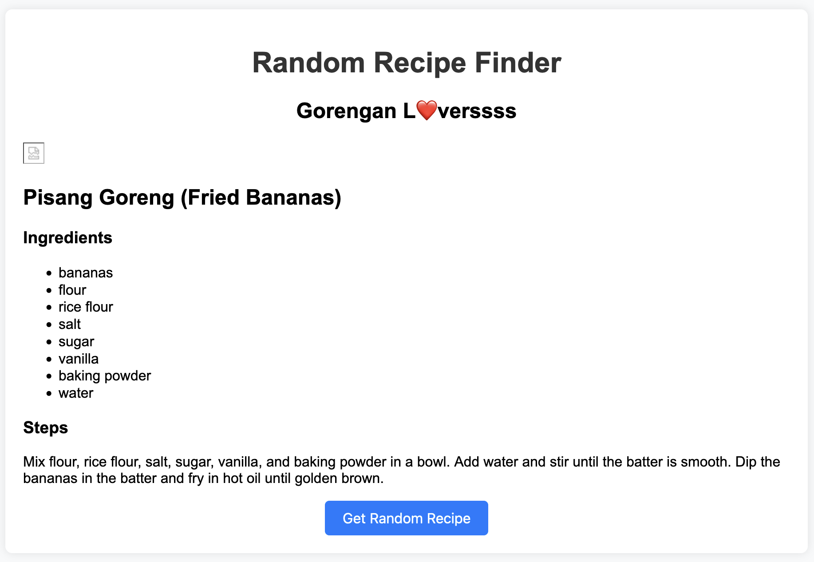

# Random Recipe Finder

This website provides a simple recipe especially for Gorengan L❤️verssss. It's so simple, so much so that anyone without cooking experience would be able to follow the recipe easily.

The "Get Random Recipe" button is kept so that it will generate different recipe in no particular order (random as the name suggests) everytime the user click on it.

## Implemented Functionality
- **Define Recipes**: An array of recipe objects is defined, where each object represents a recipe. Each recipe object has properties like `name`, `image`, `ingredients`, and `steps`.
- **Get Elements**: The getRecipeBtn and recipeContainer constants are assigned the HTML elements with the IDs `getRecipeBtn` and `recipeContainer`, respectively. These represent the “Get Random Recipe” button and the container where the recipe details will be displayed.
- **Event Listener**: An event listener is added to the “Get Random Recipe” button. When the button is clicked, a function is executed.
- **Random Recipe**: Inside the function, a random recipe is selected from the recipes array.
- **Recipe Details**: The details of the random recipe are then formatted into a string of HTML. This includes an image, the recipe name, a list of ingredients, and the steps to make the recipe.
- **Display Recipe**: Finally, the HTML string is inserted into the `recipeContainer` element, effectively displaying the details of the random recipe on the webpage.

## Screenshot

## Challenges
Unable to display image to the page.

